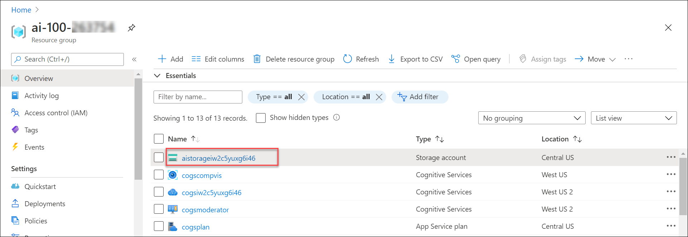
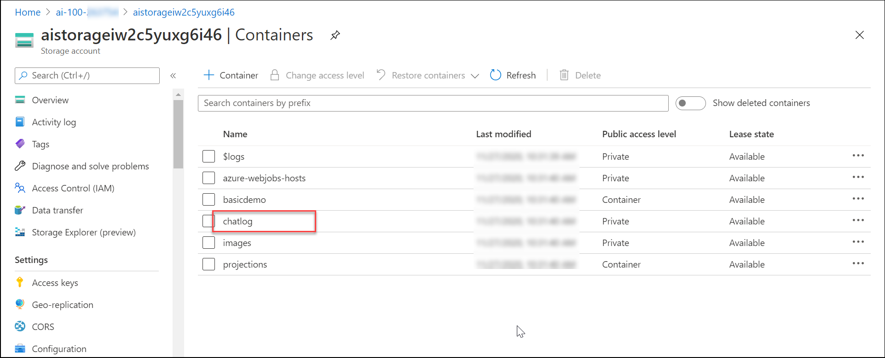
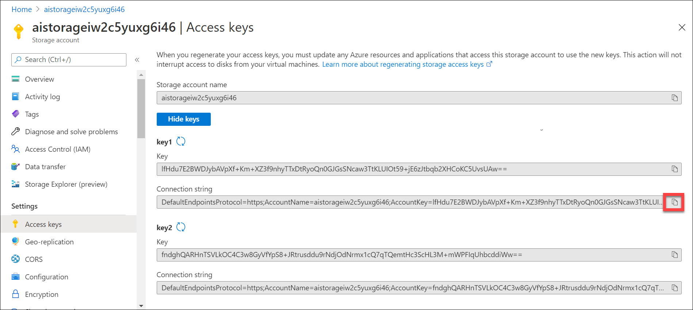

# Lab 2: Log Chats

## Introduction

This workshop demonstrates how you can perform logging using Microsoft Bot Framework and store aspects of chat conversations. After completing these labs, you should be able to:

- Understand how to intercept and log message activities between bots and users
- Log utterances to file storage

## Prerequisites

This lab starts from the assumption that you have built and published the bot from Lab1 Basic Filter Bot.

It is recommended that you do that lab in order to be able to implement logging as covered in this lab. If you have not, reading carefully through all the exercises and looking at some of the code or using it in your own applications may be sufficient, depending on your needs.

## Lab 2.0: Intercepting and analyzing messages

In this lab, we'll look at some different ways that the Bot Framework allows us to intercept and log data from conversations that the bot has with users. To start we will utilize the In Memory storage, this is good for testing purposes, but not ideal for production environments.

Afterwards, we'll look at a very simple implementation of how we can write data from conversations to files in Azure. Specifically, we'll put messages users send to the bot in a list, and store the list, along with a few other items, in a temporary file (though you could change this to a specific file path as needed)

### Using the Bot Framework Emulator

Let's take a look and what information we can glean, for testing purposes, without adding anything to our bot.

1. Open your **PictureBot.sln** in Visual Studio that you were using in the previous lab.

> **Note** You can use the **Starter** solution if you did not do Lab 1.

2. Press **F5** to run your bot

3. Open the bot in the Bot Framework Emulator and have a quick conversation:

4. Review the bot emulator debug area, notice the following:

- If you click on a message, you are able to see its associated JSON with the "Inspector-JSON" tool on the right. Click on a message and inspect the JSON to see what information you can obtain.

- The "Log" in the bottom right-hand corner, contains a complete log of the conversation. Let's dive into that a little deeper.

  - The first thing you'll see is the port the Emulator is listening on

  - You'll also see where ngrok is listening, and you can inspect the traffic to ngrok using the "ngrok traffic inspector" link. However, you should notice that we will bypass ngrok if we're hitting local addresses. **ngrok is included here for your information, as remote testing is not covered in this workshop**

  - If there is an error in the call (anything other than POST 200 or POST 201 response), you'll be able to click it and see a very detailed log in the "Inspector-JSON". Depending on what the error is, you may even get a stack trace going through the code and attempting to point out where the error has occurred. This is greatly useful when you're debugging your bot projects.

  - You can also see that there is a `Luis Trace` when we make calls out to LUIS. If you click on the `trace` link, you're able to see the LUIS information. You may notice that this is not set up in this particular lab.


You can read more about testing, debugging, and logging with the emulator [here](https://docs.microsoft.com/en-us/azure/bot-service/bot-service-debug-emulator?view=azure-bot-service-4.0).

## Lab 2.1: Logging to Azure Storage

The default bot storage provider uses in-memory storage that gets disposed of when the bot is restarted. This is good for testing purposes only. If you want to persist data but do not want to hook your bot up to a database, you can use the Azure storage provider or build your own provider using the SDK.

1. Open the **Startup.cs** file.  Since we want to use this process for every message, we'll use the `ConfigureServices` method in our Startup class to add storing information to an Azure Blob file. Notice that currently we're using:

```csharp
IStorage dataStore = new MemoryStorage();
```

As you can see, our current implementation is using in-memory storage. Again, this memory storage is recommended for local bot debugging only. When the bot is restarted, anything stored in memory will be gone.

2. Replace the current `IStorage` line with the following to change it to a FileStorage based persistance:

3. First find the below code.

  ```
  services.AddSingleton<IStorage, MemoryStorage>(sp =>
  ```
4. Replace it with the below code :-

 ```
 services.AddSingleton<IStorage, BlobsStorage>(sp =>
 ```

5. Then within the Curly Braces of **services.AddSingleton<IStorage, BlobsStorage>(sp =>** remove the existing code and add the following:-

 ```
    var blobConnectionString = Configuration.GetSection("BlobStorageConnectionString")?.Value;
    var blobContainer = Configuration.GetSection("BlobStorageContainer")?.Value;
    BlobsStorage dataStore = new BlobsStorage(blobConnectionString, blobContainer);
    return dataStore;
 ```
 
6. After performing the above steps,the code should look like below :-

```csharp
services.AddSingleton<IStorage, BlobsStorage>(sp =>
            {
                var blobConnectionString = Configuration.GetSection("BlobStorageConnectionString")?.Value;
                var blobContainer = Configuration.GetSection("BlobStorageContainer")?.Value;
                BlobsStorage dataStore = new BlobsStorage(blobConnectionString, blobContainer);
                return dataStore;
            });
```

3. Switch to the Azure Portal, navigate to your blob storage account.

   

4. From the **Overview** tab, click **Containers**

5. Check if a **chatlog** container exists, if it does not click **+Container**:

- For the name, type **chatlog**, click **OK**

   
   
6. If you haven't already done so, click **Access keys** and record your connection string. you need to click on **show keys** to view the values

   

7. Open the **appsettings.json** and add your blob connection string details:

  ```json
  "BlobStorageConnectionString": "",
  "BlobStorageContainer" :  "chatlog"
  ```

8. Press **F5** to run the bot.

9. In the emulator, go through a sample conversation with the bot.

> **Note** If you do note get a reply back, check your Azure Storage Account connection string

10. Switch to the Azure Portal, navigate to your blob storage account

11. Click **Containers**, then open the **ChatLog** container

12. Select the chat log file, it should start with **emulator...**, then select **Edit blob**.  What do you see in the files? What don't you see that you were expecting/hoping to see?

You should see something similar to this:

```json
{"$type":"System.Collections.Concurrent.ConcurrentDictionary`2[[System.String, System.Private.CoreLib],[System.Object, System.Private.CoreLib]], System.Collections.Concurrent","DialogState":{"$type":"Microsoft.Bot.Builder.Dialogs.DialogState, Microsoft.Bot.Builder.Dialogs","DialogStack":{"$type":"System.Collections.Generic.List`1[[Microsoft.Bot.Builder.Dialogs.DialogInstance, Microsoft.Bot.Builder.Dialogs]], System.Private.CoreLib","$values":[{"$type":"Microsoft.Bot.Builder.Dialogs.DialogInstance, Microsoft.Bot.Builder.Dialogs","Id":"mainDialog","State":{"$type":"System.Collections.Generic.Dictionary`2[[System.String, System.Private.CoreLib],[System.Object, System.Private.CoreLib]], System.Private.CoreLib","options":null,"values":{"$type":"System.Collections.Generic.Dictionary`2[[System.String, System.Private.CoreLib],[System.Object, System.Private.CoreLib]], System.Private.CoreLib"},"instanceId":"f80db88d-cdea-4b47-a3f6-a5bfa26ed60b","stepIndex":0}}]}},"PictureBotAccessors.PictureState":{"$type":"Microsoft.PictureBot.PictureState, PictureBot","Greeted":"greeted","Search":"","Searching":"no"}}
```

## Lab 2.2: Logging utterances to a file

For the purposes of this lab, we are going to focus on the actual utterances that users are sending to the bot. This could be useful to determine what types of conversations and actions users are trying to complete with the bot.

We can do this by updating what we're storing in our `UserData` object in the **PictureState.cs** file and by adding information to the object in **PictureBot.cs**:

1. Open **PictureState.cs**

1. **after** the following code:

    ```csharp
    public class PictureState
    {
        /// <summary>
        /// Gets or sets the number of turns in the conversation.
        /// </summary>
        /// <value>The number of turns in the conversation.</value>
    ```

    add:

    ```csharp
    // A list of things that users have said to the bot
    public List<string> UtteranceList { get; private set; } = new List<string>();
    ```

    In the above, we're simple creating a list where we'll store the list of messages that users send to the bot.

    In this example we're choosing to use the state manager to read and write data, but you could alternatively [read and write directly from storage without using state manager](https://docs.microsoft.com/en-us/azure/bot-service/bot-builder-howto-v4-storage?view=azure-bot-service-4.0&tabs=csharpechorproperty%2Ccsetagoverwrite%2Ccsetag).

    > If you choose to write directly to storage, you could set up eTags depending on your scenario. By setting the eTag property to `*`, you could allow other instances of the bot to overwrite previously written data, meaning that the last writer wins. We won't get into it here, but you can [read more about managing concurrency](https://docs.microsoft.com/en-us/azure/bot-service/bot-builder-howto-v4-storage?view=azure-bot-service-4.0&tabs=csharpechorproperty%2Ccsetagoverwrite%2Ccsetag#manage-concurrency-using-etags).

    The final thing we have to do before we run the bot is add messages to our list with our `OnTurn` action.

1. In **PictureBot.cs**, **after** the following code:

    ```csharp
    public override async Task OnTurnAsync(ITurnContext turnContext, CancellationToken cancellationToken = default(CancellationToken))
    {
    ```
    add:

    ```csharp
      var utterance = turnContext.Activity.Text;
      var state = await _accessors.PictureState.GetAsync(turnContext, () => new PictureState());
      state.UtteranceList.Add(utterance);
      await _accessors.ConversationState.SaveChangesAsync(turnContext);
    ```

    > **Note** We have to save the state if we modify it

    The first line takes the incoming message from a user and stores it in a variable called `utterance`. The next line adds the utterance to the existing list that we created in PictureState.cs.

1. Press **F5** to run the bot.

1. Have another conversation with the bot. Stop the bot and check the latest blob persisted log file. What do we have now?

    ```json
    {"$type":"System.Collections.Concurrent.ConcurrentDictionary`2[[System.String, System.Private.CoreLib],[System.Object, System.Private.CoreLib]], System.Collections.Concurrent","DialogState":{"$type":"Microsoft.Bot.Builder.Dialogs.DialogState, Microsoft.Bot.Builder.Dialogs","DialogStack":{"$type":"System.Collections.Generic.List`1[[Microsoft.Bot.Builder.Dialogs.DialogInstance, Microsoft.Bot.Builder.Dialogs]], System.Private.CoreLib","$values":[{"$type":"Microsoft.Bot.Builder.Dialogs.DialogInstance, Microsoft.Bot.Builder.Dialogs","Id":"mainDialog","State":{"$type":"System.Collections.Generic.Dictionary`2[[System.String, System.Private.CoreLib],[System.Object, System.Private.CoreLib]], System.Private.CoreLib","options":null,"values":{"$type":"System.Collections.Generic.Dictionary`2[[System.String, System.Private.CoreLib],[System.Object, System.Private.CoreLib]], System.Private.CoreLib"},"instanceId":"f80db88d-cdea-4b47-a3f6-a5bfa26ed60b","stepIndex":0}}]}},"PictureBotAccessors.PictureState":{"$type":"Microsoft.PictureBot.PictureState, PictureBot","Greeted":"greeted","UtteranceList":{"$type":"System.Collections.Generic.List`1[[System.String, System.Private.CoreLib]], System.Private.CoreLib","$values":["help"]},"Search":"","Searching":"no"}}
    ```

    >Get stuck or broken? You can find the solution for the lab up until this point under [/code/PictureBot-FinishedSolution-File](./code/PictureBot-FinishedSolution-File). You will need to insert the keys for your Azure Bot Service and your Azure Storage settings in the `appsettings.json` file. We recommend using this code as a reference, not as a solution to run, but if you choose to run it, be sure to add the necessary keys.
