# Lab 1: Creating a Customized QnA Maker Bot

## Introduction

In this lab we will explore the QnA Maker for creating bots that connect to a pre-trained knowledge base.  Using QnAMaker, you can upload documents or point to web pages and have it pre-populate a knowledge base that can feed a simple bot for common uses such as frequently asked questions.

## Lab 1.1: QnA Maker Setup

1. In a web browser, navigate to ```https://portal.azure.com```. You will be redirected to sign-in page, use the credentials provided below for sign-in.
    * Azure Username/Email: <inject key="AzureAdUserEmail"></inject>
    * Azure Password: <inject key="AzureAdUserPassword"></inject>.

2. Now in the azure portal, select **+ Create a Resource**

   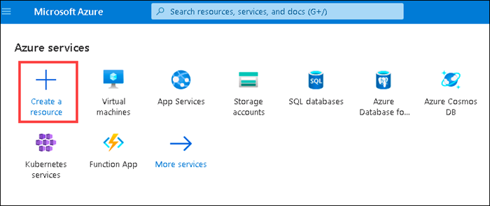

3. In the search bar type **QnA Maker**, then select **QnA Maker**

   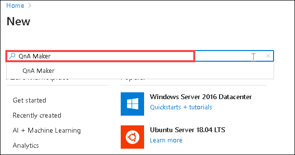

4. Select **Create**
  
   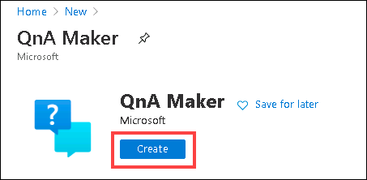
   
5. On the create page under **Project details** enter the following details:
   
   - **Resource Group** : Select ai-100-deploymentid resource group
   
   - **Name** : Enter a unique name 
   
   - **Pricing tier** : Select the **S0** tier. We aren't using the free tier because we will upload files that are larger than 1MB later.
   
   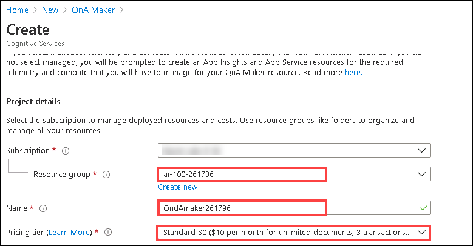
   
6. On the same page under **Azure Search details - for data** enter:
   
   - **Azure search pricing tier** : select the **F** tier
   
   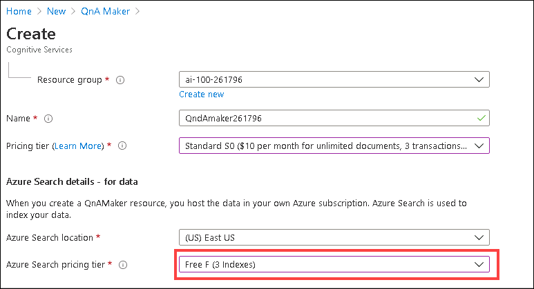
   
7. Now under **App Service details - for runtime** enter the following and select **Review + create**.
   
   - **App name** : Enter an app name, it must be unique
   
   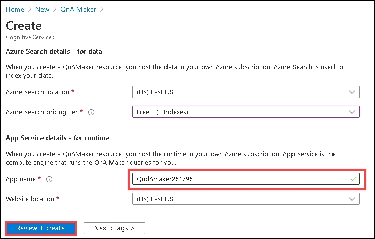

10. Select **Create**.  This will create the following resources in your resource group:

- App Service Plan
- App Service
- Application Insights
- Search Service
- Cognitive Service instance of type QnAMaker

  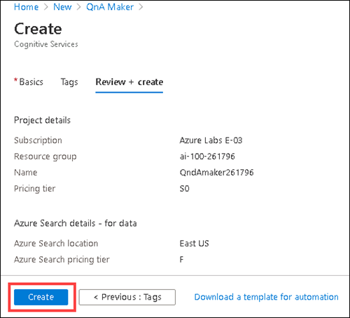

## Lab 1.2: Create a KnowledgeBase

1. Open the ```https://www.qnamaker.ai/```

1. In the top right, select **Sign in**.  Login using the Azure credentials for your new QnA Maker resource.

   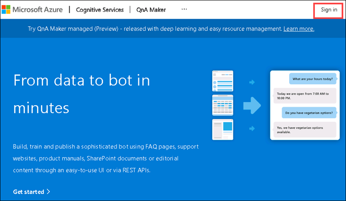

1. In the top navigation area, select **Create a knowledge base**

   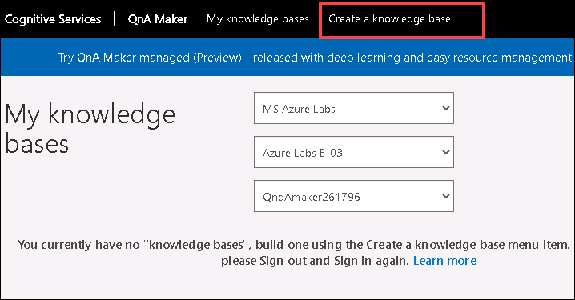

1. Skip **STEP 1** as you have already created the resource

1. Select your Azure AD and Subscription tied to your QnA Maker resource, then select your newly created QnA Maker resource and your target language.

   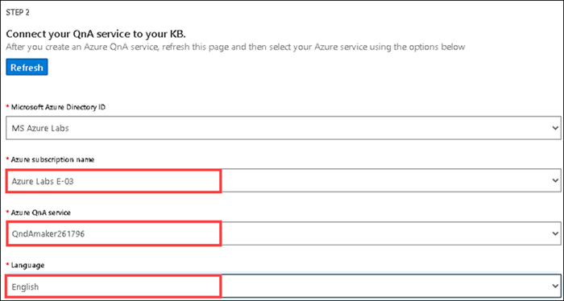

1. For the name, type **Microsoft FAQs**

   

1. For the file, select **Add file**, browse to the **C:\AllFiles\AI-100-Design-Implement-Azure-AISol-master\Lab5-QnA/surface-pro-4-user-guide-EN.pdf** file and click on open.

   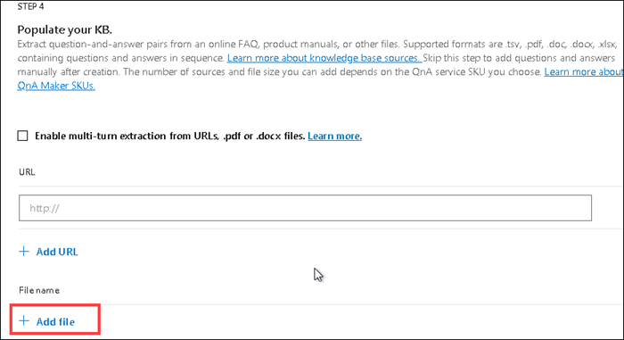
   
   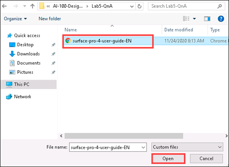

1. For the file, again select **Add file**, browse to the **C:\AllFiles\AI-100-Design-Implement-Azure-AISol-master\Lab5-QnA/Manage Azure Blob Storage** file and click on open.

   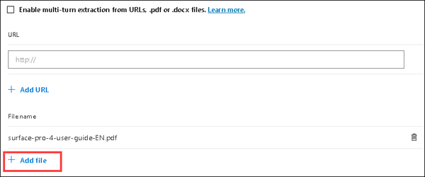

   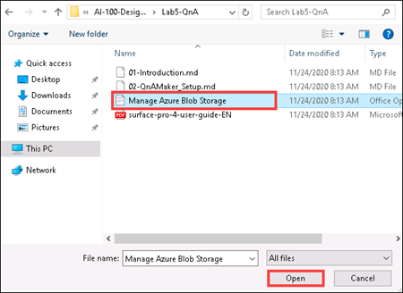


      > **Note** You can find out more about the supported file types and data sources ```https://docs.microsoft.com/en-us/azure/cognitive-services/qnamaker/concepts/data-    sources-supported```

1. For the **Chit-chat**, select **Witty**

   

1. Select **Create your KB**

   

> **NOTE** This can take a few minutes.

## Lab 1.3: Publish and Test your Knowledge base

1. Review the knowledge base QnA pairs, you should see ~200+ different pairs based on the two documents we fed it

1. In the top menu, select **PUBLISH**.  

   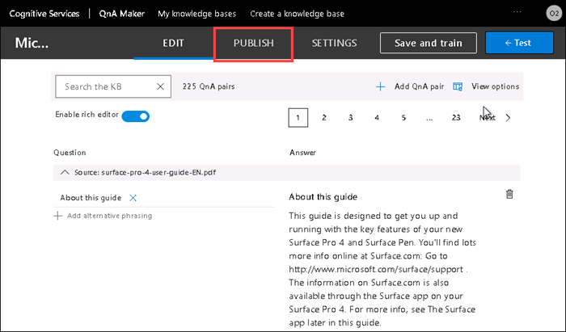

1. On the publish page, select **Publish**.  Once the service is published, select the **Create Bot** button on the success page

   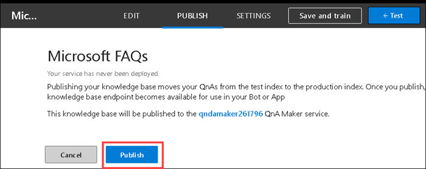

   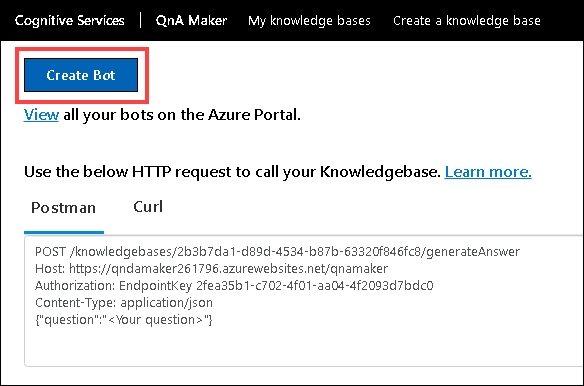
   
1. If prompted, login as the account tied to your lab resource group.

1. On the bot service creation page, fix any naming errors, then select **Create**.

   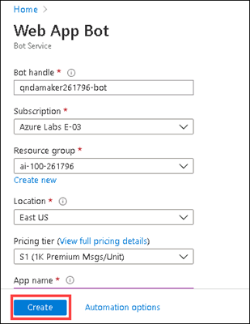

   > **Note**  Recent change in Azure requires dashes ("-") be removed from some resource names

1. Once the bot resource is created, navigate to the new **Web App Bot**, then select **Test in Web Chat**

   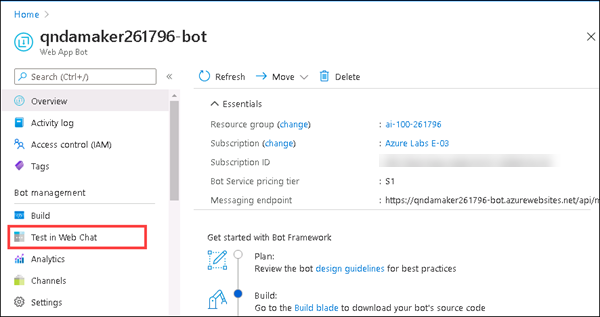

1. Ask the bot any questions related to a Surface Pro 4 or managing Azure Blog Storage:

      - How do I add memory?
      - How long does it take to charge the battery?
      - How do I hard reset?
      - What is a blob?

      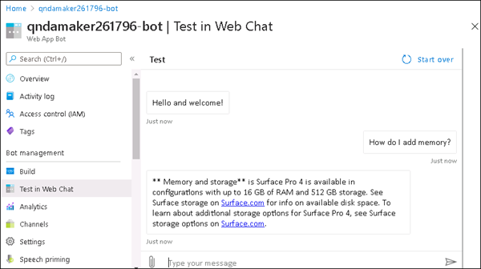
      
1. Ask it some questions it doesn't know, such as:

- How do I bowl a strike?

## Lab 1.4: Download the Bot Source code

1. Under **Bot management**, select the **Build** tab

   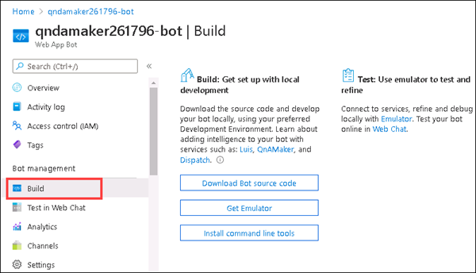

1. Select **Download Bot source code**, when prompted select **Yes**.  

   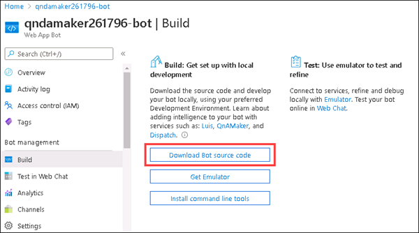
   
   [](./images/img26.png)

1. Azure will build your source code, when complete, select **Download Bot source code**, if prompted, select **Yes**

1. Extract the zip file to your local computer

1. Open the .sln solution file with Visual Studio 2019

1. Open the **Startup.cs** file, you will notice nothing special has been added here

1. Open the **Bots/{BotName}.cs** file and review the code that was generated for this file

1. Open the **BotService.cs** file and review the code that was generated for this file.

[!NOTE] The previous steps for reviewing the generated code are correct for the solution that was downloaded during the authoring of this lab.  The solution files may change from time to time based on updates to the frameworks and SDKs so the solution files may differ.  The key aspect here is just have you review the code that is automatically generated from the tool.


## Resources

- [What is the QnA Maker service?](https://docs.microsoft.com/en-us/azure/cognitive-services/qnamaker/overview/overview)
