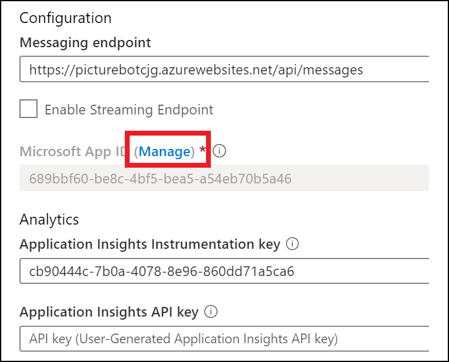

# Lab 2: Integrate LUIS into Bot Dialogs


## Introduction

Our bot is now capable of taking in a user's input and responding based on the user's input. Unfortunately, our bot's communication skills are brittle. One typo, or a rephrasing of words, and the bot will not understand. This can cause frustration for the user. We can greatly increase the bot's conversational abilities by enabling it to understand natural language with the LUIS model we built in the previous lab.

We will have to update our bot in order to use LUIS.  We can do this by modifying "Startup.cs" and "PictureBot.cs."

> NOTE: If you intend to use the code in the Finished folder, you MUST replace the app specific information with your own app IDs and endpoints.

## Lab 2.1: Create an Azure Web App Bot

1. Navigate to the `Azure portal` from virtual machine.

2. In the portal, navigate to your resource group, then select **+Add** and search for **bot**.

   

3. Select **Web App Bot**, and select **Create**.

4. Provide the follwing details and click on **Create**

      * For the name, you'll have to create a unique identifier. We recommend using something along the lines of PictureBot[i][n] where [i] is your initials and [n] is a number (e.g. mine would be PictureBotamt6).

      * Select a region and for pricing tier, select **F0 (10K Premium Message)**.

      * Select the Bot template area and Select **C#**, then select **Echo Bot**, later we will update it to our our PictureBot.

        

      * Select **OK**, make sure that **Echo Bot** is displayed.

      * Configure a new App service plan (put it in the same location as your bot)

      * You can choose to turn Application Insights on or off.

      * **Do not** change or select on **Auto create App ID and password**, we will get to that later.

5. When it's deployed, navigate to the new `Azure Web App Bot` Resource, select **Settings** under **Bot Management**

6. Select the **Manage** link for the **Microsoft App ID**

   

7. Select **New client secret**., give name as **PictureBot**. For expires select **Never** and then select **Add**.

8. Record the secret into notepad and select **Overview**, also record the `Application Id` into notepad.

9. Navigate back to the **web app bot** resource, under **Bot management**, select the **Test in Web Chat** tab

10. Once it starts, explore what it is capable of doing.  As you will see, it only echos back your message.

    

## Lab 2.2: Adding natural language understanding

### Adding LUIS to Startup.cs

1. If not already open, open your **PictureBot** solution in Visual Studio

> **NOTE** You can also start with the **C:\AllFiles\AI-100-Design-Implement-Azure-AISol-master\Lab7-Integrate_LUIS\code\Starter\PictureBotPictureBot.sln** solution if you did not start from Lab 1.
> Be sure to replace all the app settings values

  
  
  
  
1. Open **Startup.cs** and locate the `ConfigureServices` method. We'll add LUIS here by adding an additional service for LUIS after creating and registering the state accessors. You may notice a debugger placed somewhere around line 61, Please remove it by clicking on the red button on the particular line.

  

Below:

```csharp
services.AddSingleton((Func<IServiceProvider, PictureBotAccessors>)(sp =>
{
    .
    .
    .
    return accessors;
});
```

Add: (you will have to add the below code after line 138)

```csharp
// Create and register a LUIS recognizer.
services.AddSingleton(sp =>
{
    var luisAppId = Configuration.GetSection("luisAppId")?.Value;
    var luisAppKey = Configuration.GetSection("luisAppKey")?.Value;
    var luisEndPoint = Configuration.GetSection("luisEndPoint")?.Value;

    // Get LUIS information
    var luisApp = new LuisApplication(luisAppId, luisAppKey, luisEndPoint);

    // Specify LUIS options. These may vary for your bot.
    var luisPredictionOptions = new LuisPredictionOptions
    {
        IncludeAllIntents = true,
    };

    // Create the recognizer
    var recognizer = new LuisRecognizer(luisApp, luisPredictionOptions, true, null);
    return recognizer;
});
```

 

1. Modify the **appsettings.json** to include the following properties, be sure to fill them in with your LUIS instance values:

```json
"luisAppId": "",
"luisAppKey": "",
"luisEndPoint": ""
```

1. To find the luisAppId, Navigate to the cognitive services website and then go to Manage -> Settings and copy the application Id

   
   
1. For Luis app key and endpoint, Navigate to cognitive services - **luisbotdeploymentID** in azure portal , then find **Keys and Endpoint** and copy any one key value and the endpoint value.

   
   
1. After editing the **appsettings.json**, it will look like the below image.

   
   
## Lab 2.3: Adding LUIS to PictureBot's MainDialog

1. Open **PictureBot.cs.** , find it under Bots. The first thing you'll need to do is initialize the LUIS recognizer, similar to how you did for `PictureBotAccessors`. Below the commented line `// Initialize LUIS Recognizer`, add the following:

```csharp
private LuisRecognizer _recognizer { get; } = null;
```


1. Navigate to the **PictureBot** constructor:

```csharp
public PictureBot(PictureBotAccessors accessors, ILoggerFactory loggerFactory /*, LuisRecognizer recognizer*/)
```

Now, maybe you noticed we had this commented out in your previous labs, maybe you didn't. You have it commented out now, because up until now, you weren't calling LUIS, so a LUIS recognizer didn't need to be an input to PictureBot. Now, we are using the recognizer.

1. Uncomment the input requirement (parameter `LuisRecognizer recognizer`), and add the following line below `// Add instance of LUIS Recognizer`:

```csharp
_recognizer = recognizer ?? throw new ArgumentNullException(nameof(recognizer));
```

After the changes it should look like this :-
 
Again, this should look very similar to how we initialized the instance of `_accessors`.

As far as updating our `MainDialog` goes, there's no need for us to add anything to the initial `GreetingAsync` step, because regardless of user input, we want to greet the user when the conversation starts.

1. In `MainMenuAsync`, we do want to start by trying Regex, so we'll leave most of that. However, if Regex doesn't find an intent, we want the `default` action to be different. That's when we want to call LUIS.

Within the `MainMenuAsync` switch block, replace (you will be able to find this block in lines 176-180):

```csharp
default:
    {
        await MainResponses.ReplyWithConfused(stepContext.Context);
        return await stepContext.EndDialogAsync();
    }
```

With:

```csharp
default:
{
    // Call LUIS recognizer
    var result = await _recognizer.RecognizeAsync(stepContext.Context, cancellationToken);
    // Get the top intent from the results
    var topIntent = result?.GetTopScoringIntent();
    // Based on the intent, switch the conversation, similar concept as with Regex above
    switch ((topIntent != null) ? topIntent.Value.intent : null)
    {
        case null:
            // Add app logic when there is no result.
            await MainResponses.ReplyWithConfused(stepContext.Context);
            break;
        case "None":
            await MainResponses.ReplyWithConfused(stepContext.Context);
            // with each statement, we're adding the LuisScore, purely to test, so we know whether LUIS was called or not
            await MainResponses.ReplyWithLuisScore(stepContext.Context, topIntent.Value.intent, topIntent.Value.score);
            break;
        case "Greeting":
            await MainResponses.ReplyWithGreeting(stepContext.Context);
            await MainResponses.ReplyWithHelp(stepContext.Context);
            await MainResponses.ReplyWithLuisScore(stepContext.Context, topIntent.Value.intent, topIntent.Value.score);
            break;
        case "OrderPic":
            await MainResponses.ReplyWithOrderConfirmation(stepContext.Context);
            await MainResponses.ReplyWithLuisScore(stepContext.Context, topIntent.Value.intent, topIntent.Value.score);
            break;
        case "SharePic":
            await MainResponses.ReplyWithShareConfirmation(stepContext.Context);
            await MainResponses.ReplyWithLuisScore(stepContext.Context, topIntent.Value.intent, topIntent.Value.score);
            break;
        case "SearchPic":
            await MainResponses.ReplyWithSearchConfirmation(stepContext.Context);
            await MainResponses.ReplyWithLuisScore(stepContext.Context, topIntent.Value.intent, topIntent.Value.score);
            break;
        default:
            await MainResponses.ReplyWithConfused(stepContext.Context);
            break;
    }
    return await stepContext.EndDialogAsync();
}
```

Let's briefly go through what we're doing in the new code additions. First, instead of responding saying we don't understand, we're going to call LUIS. So we call LUIS using the LUIS Recognizer, and we store the Top Intent in a variable. We then use `switch` to respond in different ways, depending on which intent is picked up. This is almost identical to what we did with Regex.

> **Note** If you named your intents differently in LUIS than instructed in the code accompanying [Lab 6](../Lab6-Implement_LUIS/02-Implement_LUIS.md), you need to modify the `case` statements accordingly.

Another thing to note is that after every response that called LUIS, we're adding the LUIS intent value and score. The reason is just to show you when LUIS is being called as opposed to Regex (you would remove these responses from the final product, but it's a good indicator for us as we test the bot).

## Lab 2.4: Testing natural speech phrases

1.Right-click the project, select **Manage Nuget Packagaes** in VSTS

  Select the Browse tab, and install the following packages, ensure that you are using version 4.6.3:

   * Microsoft.Bot.Builder.Azure
   * Microsoft.Bot.Builder.AI.Luis
   * Microsoft.Bot.Builder.Dialogs
   * Microsoft.Azure.Search (version, 10.1.0 or later)

1. Press **F5** to run the app. The localhost will pop-up in the default browser and copy the endpoint URL as shown in the below image.

   

1. Switch to your Bot Emulator. Try sending the bots different ways of searching pictures. What happens when you say "send me pictures of water" or "show me dog pics"? Try some other ways of asking for, sharing and ordering pictures. For this follow the below instructions.

1. Open the bot emulator from the desktop. **Note**:- it will ask for update , please update the bot emulator.

   
   
   

1. Click on **Create a new bot configuration**.

   
   
1. Enter the bot name and the endpoint url you copied in the first step of this particular process. Click **Save And Connect**.

   
   
1. Save the config file to the local computer.

   
   
1. The bot will appear and you can search for the utterences.

   

If you have extra time, see if there are things LUIS isn't picking up on that you expected it to. Maybe now is a good time to go to luis.ai, [review your endpoint utterances](https://docs.microsoft.com/en-us/azure/cognitive-services/LUIS/label-suggested-utterances), and retrain/republish your model.

> **Fun Aside**: Reviewing the endpoint utterances can be extremely powerful.  LUIS makes smart decisions about which utterances to surface.  It chooses the ones that will help it improve the most to have manually labeled by a human-in-the-loop.  For example, if the LUIS model predicted that a given utterance mapped to Intent1 with 47% confidence and predicted that it mapped to Intent2 with 48% confidence, that is a strong candidate to surface to a human to manually map, since the model is very close between two intents.

## Going further

If you're having trouble customizing your LUIS implementation, review the documentation guidance for adding LUIS to bots [here](https://docs.microsoft.com/en-us/azure/bot-service/bot-builder-howto-v4-luis?view=azure-bot-service-4.0&tabs=cs).

>Get stuck or broken? You can find the solution for the lab up until this point under [code/Finished](./code/Finished). You will need to insert the keys for your Azure Bot Service in the `appsettings.json` file. We recommend using this code as a reference, not as a solution to run, but if you choose to run it, be sure to add the necessary keys (in this section, there shouldn't be any).
