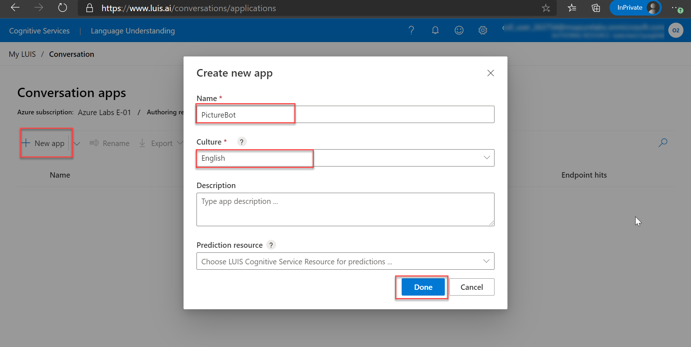

# Lab 3 - Detect Language

In this lab we are going to integrate language detection ability of cognitive services into our bot.

## Lab 3.0 : Creating a LUIS APP

1. Navigate to [https://www.luis.ai](https://www.luis.ai). We will create a new LUIS app to support our bot.

1. Sign in using the azure credentials provided.You can get the credentials from the **Environment Details** page.

1. In **Welcome to the Language Understanding Intelligent Service (LUIS)!**, select the subscription available and click **Select or create an authoring resource**.

1. On the **My Apps** dashboard, select your **Subscription** and **Authoring resource** from the dropdown menu.

   

1. To create a new app, click on **+ New app for conversation**, from the dropdown select **New app for conversation**

1. On the **Create new app** page, type a name, description and select Done. Close the "How to create an effective LUIS app" dialog.

   

1. From the Luisapp dashboard, select the Luis app which we created in the previous lab and click on Manage in the top toolbar.

1. Select Settings from the left hand side menu and copy the App ID value to notepad.

   

1. From Azure portal, navigate to resource group and select the cognitive service resource that starts with **luisbot**

   

1. Select Keys and Endpoint from the left hand side menu which is under **Resource Management** and copy the values of **Key1** and **Endpoint** into notepad.

   

## Lab 3.1: Retrieve your Cognitive Services url and keys

1. Open the Azure Portal https://portal.azure.com

2. Navigate to your resource group, select the cognitive services resource named **cogsmoderator**.

3. Under **RESOURCE MANAGEMENT**, select the **Keys and Endpoint** tab and record the Endpoint and the key 1 for the cognitive services resource.

   

## Lab 3.2: Add language support to your bot

1. Please open the **PictureBot** solution from **C:\AllFiles\AI-100-Design-Implement-Azure-AISol-master\Lab8-Detect_Language\code\Finished\PictureBot.sln**

      >**Note:** please make sure we are selecting the solution from the finished folder

2. Right-click the project and select **Manage Nuget Packages**

3. Select **Browse**

4. Search for **Microsoft.Azure.CognitiveServices.Language.TextAnalytics**, select it then select **Install**, then select **I Accept**

5. Open the **Startup.cs** file, check the following using statements:

    ```csharp
    using Azure.AI.TextAnalytics;
    using Azure;
    ```

6. Check the following code in the **ConfigureServices** method:

    ```csharp
    services.AddSingleton<TextAnalyticsClient>(sp =>
    {
        Uri cogsBaseUrl = new Uri(Configuration.GetSection("cogsBaseUrl")?.Value);
        string cogsKey = Configuration.GetSection("cogsKey")?.Value;

        var credentials = new AzureKeyCredential(cogsKey);
        return new TextAnalyticsClient(cogsBaseUrl, credentials);
    });
    ```

7. Open the **PictureBot.cs** file, Check the following using statements:

    ```csharp
    using Azure.AI.TextAnalytics;
    ```

8. Check the following class variable:

    ```csharp
    private TextAnalyticsClient _textAnalyticsClient;
    ```

9. Check the constructor if it includes the new `TextAnalyticsClient`:

    ```csharp
    public PictureBot(PictureBotAccessors accessors, LuisRecognizer recognizer, TextAnalyticsClient analyticsClient)
    ```

10. Inside the constructor, check if the class variable initialized:

    ```csharp
    _textAnalyticsClient = analyticsClient;
    ```

11. Navigate to the **OnTurnAsync** method and find the following line of code:

    ```csharp
    var utterance = turnContext.Activity.Text;
    var state = await _accessors.PictureState.GetAsync(turnContext, () => new PictureState());
    state.UtteranceList.Add(utterance);
    await _accessors.ConversationState.SaveChangesAsync(turnContext);
    ```

12. Check if the following line of code after it

    ```csharp
    //Check the language
        DetectedLanguage detectedLanguage = _textAnalyticsClient.DetectLanguage(turnContext.Activity.Text);
        switch (detectedLanguage.Name)
        {
            case "English":
                break;
            default:
                //throw error
                await turnContext.SendActivityAsync($"I'm sorry, I can only understand English. [{detectedLanguage.Name}]");
                break;
        }
    ```

13. Everyting you have in the method after `switch` ends move to the `case "English"`. Finally your method should looks like following:

    ```csharp
    public override async Task OnTurnAsync(ITurnContext turnContext, CancellationToken cancellationToken = default(CancellationToken))
    {
        if (turnContext.Activity.Type is "message")
        {
            var utterance = turnContext.Activity.Text;
            var state = await _accessors.PictureState.GetAsync(turnContext,() => new PictureState());
            state.UtteranceList.Add(utterance);
            await _accessors.ConversationState.SaveChangesAsync(turnContext);

            //Check the language
            DetectedLanguage detectedLanguage = _textAnalyticsClient.DetectLanguage(turnContext.Activity.Text);
            switch (detectedLanguage.Name)
            {
                    case "English":
                        // Establish dialog context from the conversation state.
                        var dc = await _dialogs.CreateContextAsync(turnContext);
                        // Continue any current dialog.
                        var results = await dc.ContinueDialogAsync(cancellationToken);

                        // Every turn sends a response, so if no response was sent,
                        // then there no dialog is currently active.
                        if (!turnContext.Responded)
                        {
                            // Start the main dialog
                            await dc.BeginDialogAsync("mainDialog", null, cancellationToken);
                        }
                        break;
                    default:
                        //throw error
                        await turnContext.SendActivityAsync($"I'm sorry, I can only understand English. [{detectedLanguage.Name}]");
                        break;
            }
        }
    }
    ```


14. Open the **appsettings.json** file and ensure that your cognitive services settings and LUIS app settings are entered:

```csharp
"cogsBaseUrl": "",
"cogsKey" :  "",
"luisAppId": "",
"luisAppKey": "",
"luisEndPoint": ""
```

`Note: For cogsBaseURL and cogsKey , got to azure portal and copy the key and endpoint of cogsmoderator and put key value in cogskey and put endpoint value in cogsBaseURL  and use the values of LUIS app you copied earlier to notepad`

15. Also, add following values that you collected in previous Labs.

```
  "MicrosoftAppId": "YourAppID", -> mention the application id of the web app bot created earlier.
  "MicrosoftAppPassword": "YourAppIDKey", -> mention the secret key of the web app bot created earlier.
  "BlobStorageConnectionString": "DefaultEndpointsProtocol=https;AccountName=XXXXX;AccountKey=XXXXX;EndpointSuffix=core.windows.net",
  "BlobStorageContainer": "chatlog"

```

16. Press **F5** to start your bot

17. Using the Bot Emulator, send in a few phrases and see what happens:

- Como Estes?
- Bon Jour!
- Привет
- Hello
